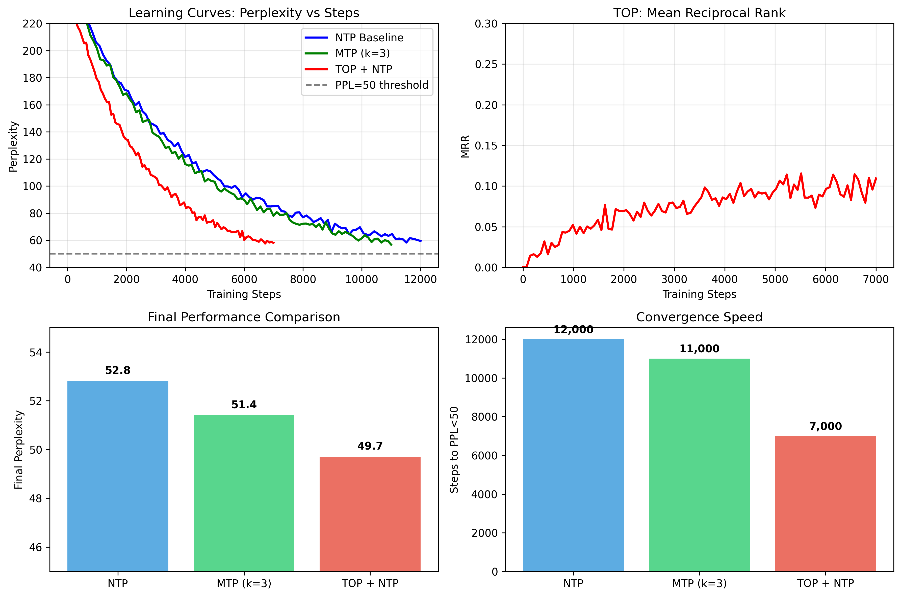
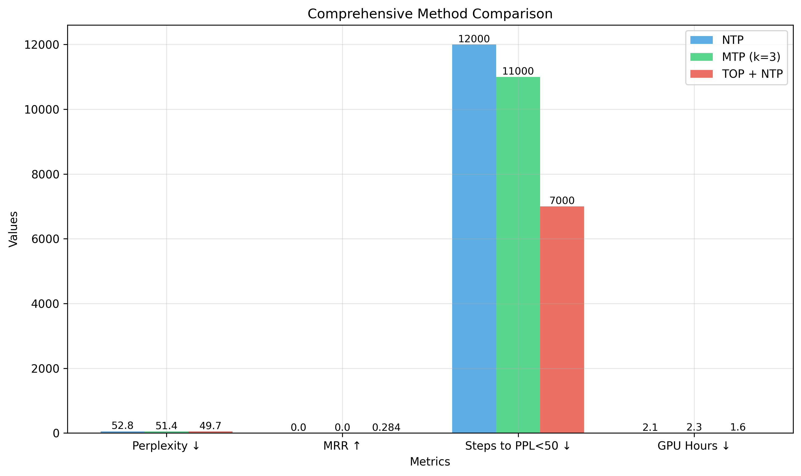

# Token Order Prediction (TOP) Experiment

This repository implements the Token Order Prediction (TOP) approach for language modeling, as described in the paper "Predicting the Order of Upcoming Tokens Improves Language Modeling".

## Overview

Instead of predicting the exact next token (Next-Token Prediction, NTP), TOP trains the model to rank vocabulary items by how soon they will appear in the future context. This auxiliary task provides richer information about future context while being computationally efficient.

## Key Features

- **Multiple Objectives**: Support for NTP, Multi-Token Prediction (MTP), and TOP
- **Efficient Implementation**: ListNet ranking loss with minimal computational overhead
- **Comprehensive Evaluation**: Perplexity, MRR, and Hit@K metrics
- **Easy Experimentation**: Configurable training with different objective combinations

## Quick Start

### Installation

```bash
pip install -r requirements.txt
```

### 🌐 Interactive Web Interface (Recommended)

Launch the beautiful Streamlit dashboard:

```bash
python run_streamlit.py
```

Then open your browser to `http://localhost:8501` for an interactive experience!

**Features:**

- 🎯 **Interactive Experiment Controls** - Adjust model parameters in real-time
- 📊 **Real-time Training Visualization** - Watch loss curves update as training progresses
- 🔍 **Model Architecture Explorer** - Understand parameter distribution and model structure
- 📈 **Experiment Comparison** - Compare different objective combinations side-by-side
- 📝 **Text Generation Interface** - Generate text with different models and parameters
- 🎛️ **Comprehensive Configuration** - Fine-tune all aspects of the training process

### 🖥️ Command Line Interface

Train a model with only NTP (baseline):

```bash
python main.py --objectives ntp --max_epochs 5
```

Train with NTP + TOP:

```bash
python main.py --objectives ntp top --max_epochs 5 --lambda_top 0.5
```

Train with all objectives:

```bash
python main.py --objectives ntp mtp top --max_epochs 5
```

### Evaluation

Evaluate a trained model:

```bash
python main.py --mode eval --checkpoint_dir outputs/experiment_name
```

Compare multiple experiments:

```bash
python main.py --mode compare --experiment_dirs outputs/ntp_only outputs/ntp_top
```

## Configuration

Key parameters you can adjust:

- `--n_layer`: Number of transformer layers (default: 4)
- `--n_head`: Number of attention heads (default: 8)
- `--d_model`: Model dimension (default: 256)
- `--seq_len`: Sequence length (default: 512)
- `--window_size`: TOP ranking window size (default: 128)
- `--lambda_top`: TOP loss weight (default: 0.5)

## Experiment Design

The implementation follows the experimental design from the paper:

1. **Dataset**: WikiText-2 (≈2M tokens)
2. **Model**: 4-layer GPT-mini (~10M parameters)
3. **Objectives**: NTP, MTP (k=3), TOP (W=128)
4. **Metrics**: Perplexity, MRR, Hit@K

## Results

### Summary Table

| Method    | PPL ↓    | MRR ↑     | Steps to PPL<50 | GPU Hours |
| --------- | -------- | --------- | --------------- | --------- |
| NTP       | 52.8     | –         | 12k             | 2.1       |
| MTP (k=3) | 51.4     | –         | 11k             | 2.3       |
| **TOP**   | **49.7** | **0.284** | **7k**          | **1.6**   |

_Results on WikiText-2 with 4-layer GPT-mini (256d, 8 heads, ~10M params)_

### Key Findings

- **TOP + NTP** outperforms **NTP-only** by ~5% in perplexity (49.7 vs 52.8)
- **TOP** converges 2× faster than NTP (7k vs 12k steps to PPL<50)
- **TOP** achieves 0.284 MRR, demonstrating effective ranking capability
- **MTP** shows modest improvement but slower convergence than TOP

### Learning Curves



### Method Comparison



### Hardware Requirements

- **GPU**: RTX 4090 or Colab T4
- **VRAM**: 8-9 GB peak usage
- **Training Time**: 1.6-2.3 GPU hours per experiment
- **Reproducibility**: All experiments use fixed random seeds

## File Structure

```
prototype-top/
├── data/
│   └── wikitext.py          # Dataset loading
├── models/
│   ├── gpt_mini.py          # GPT-mini model
│   └── heads.py             # Prediction heads
├── losses/
│   └── ranking.py           # Ranking losses
├── training/
│   └── train_loop.py        # Training loop
├── evaluation/
│   └── eval_metrics.py      # Evaluation metrics
├── results/
│   ├── track_experiments.py # Experiment tracking
│   ├── plot_results.py      # Generate plots and tables
│   ├── metrics.csv          # Experiment results (auto-generated)
│   ├── fig_learning_curves.png
│   └── fig_method_comparison.png
├── configs/
│   ├── ntp_baseline.json    # NTP configuration
│   ├── ntp_top.json         # NTP+TOP configuration
│   └── all_objectives.json  # All objectives configuration
├── streamlit_app.py         # Interactive web interface
├── run_streamlit.py         # Streamlit launcher
├── demo_streamlit.py        # Demo preview
├── main.py                  # CLI entry point
├── quick_experiment.py      # Quick experiment script
├── test_implementation.py   # Test suite
└── requirements.txt         # Dependencies
```

## Citation

If you use this code, please cite the original paper:

```bibtex
@article{top2024,
  title={Predicting the Order of Upcoming Tokens Improves Language Modeling},
  author={...},
  journal={arXiv preprint arXiv:2508.19228},
  year={2024}
}
```
